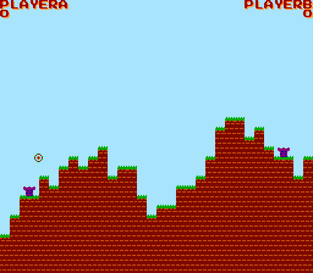

# Towers (Nintendo Entertainment System)

**Towers** is a simple, 2 player, turn-based [artillery game](https://en.wikipedia.org/wiki/Artillery_game) for the Nintendo Entertainment System (NES). Each player controls a tower which can shoot projectiles at the opponent to annihilate it eventually. The terrain is destructible, too. The game was implemented for educational purposes. Hence it lacks some features which would make it more enjoyable, but it allowed me to get somewhat familiar with the ancient architecture and have fun :).



### How to run the game

You will need two utilities: __NESASM__ assembler and __FCEUX__ emulator. Once you have installed them both and cloned the repository, enter the project's directory and run the following commands:

```bash
[towers]$ nesasm towers.asm 
NES Assembler (v3.1)

pass 1
pass 2
[towers]$ fceux towers.nes
```
